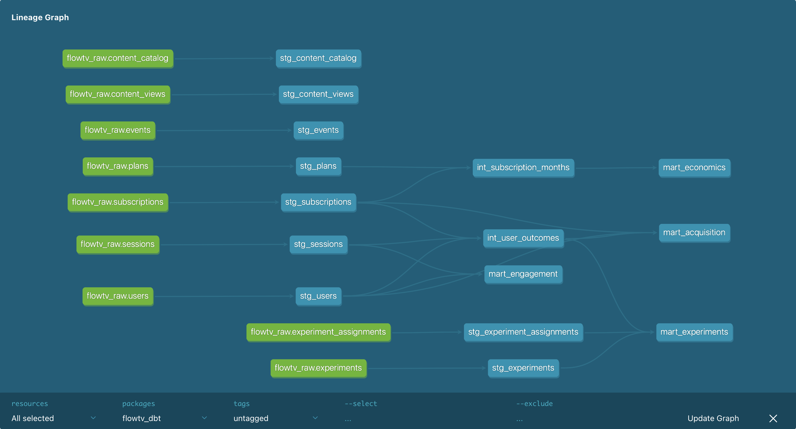

# FlowTV — Streaming Analytics Suite

An end-to-end analytics engineering project for a fictional subscription streaming
service. Synthetic event data flows through a modern data stack — **Python → BigQuery →
dbt → Tableau** — to produce four executive dashboards covering acquisition, retention,
subscriber economics, and A/B experimentation.

**[▶ View the live dashboards on Tableau Public](https://public.tableau.com/app/profile/yuechen.wang6046/viz/FlowTVStreamingAnalyticsSuite/AcquisitionConversion)**



---

## TL;DR

- **What:** A production-style analytics pipeline on a cloud data warehouse, modeling
  100,000 synthetic users across 18 months of subscription activity.
- **Stack:** Python (data generation) · Google BigQuery (warehouse) · dbt Core
  (transformation, testing, docs) · Tableau (visualization).
- **Scale:** 9 source tables, ~1.4M event/session rows, 17 dbt models, 34 data-quality
  tests, 4 dashboards.
- **Why it matters:** Demonstrates the full analytics-engineering workflow —
  dimensional modeling, layered transformations, testing, documentation, and BI
  delivery — not just chart-building.

---

## Key Insights

The dashboards surface findings a product or growth team would act on:

1. **Referral is the most efficient acquisition channel by a wide margin** — ~18x
   LTV/CAC versus 3–7x for paid channels (paid_search, paid_social, display). Referral
   and affiliate together outperform every paid source on lifetime value per dollar spent.

2. **Retention stabilizes in a healthy band.** After the expected early drop, D7–13
   retention holds around 55–60% and the long tail (D30–D90+) settles near 30–35%,
   consistent across monthly signup cohorts — a sign of durable product-market fit
   rather than a leaky funnel.

3. **A/B test win — Paywall Copy (Urgency):** the urgency-framed paywall lifted
   conversion **+11%** *and* D30 retention **+11%** versus the value-framed control.
   A rare win on both a surface and a deep metric — clear candidate for 100% rollout.

4. **A/B test losses — Pricing and Trial Length:** raising price to $14.99 cost ~10%
   conversion with no retention upside, and a 14-day trial underperformed the 7-day
   control on both conversion (-10%) and retention (-9%). Both recommend keeping the
   current settings.

---

## Architecture

```
┌─────────────┐     ┌──────────────┐     ┌─────────────────────┐     ┌──────────────┐
│   Python    │     │   BigQuery   │     │      dbt Core       │     │   Tableau    │
│  generator  │ ──▶ │  flowtv_raw  │ ──▶ │ staging → int →     │ ──▶ │  4 dashboards│
│ (synthetic) │     │ (9 raw CSVs) │     │ marts (+ tests/docs)│     │  (Public)    │
└─────────────┘     └──────────────┘     └─────────────────────┘     └──────────────┘
```

**dbt layering**

- **staging** (`stg_*`, views): one model per source — light cleaning and column
  selection, the single place raw columns are referenced.
- **intermediate** (`int_*`, views): reusable business logic — per-user conversion and
  retention outcomes, the funnel, first-subscription resolution, and the
  subscription-month explosion for MRR.
- **marts** (`mart_*`, tables): four analytical tables, one per dashboard, materialized
  for fast BI queries.
- **seeds**: `channel_cac.csv` — a reference lookup for per-channel acquisition cost,
  modeled as a seed instead of a hardcoded CASE statement.

---

## The Dashboards

| # | Dashboard | Grain | Highlights |
|---|-----------|-------|------------|
| 1 | **Acquisition & Conversion** | one row per user | 5-stage funnel, channel performance (conversion vs CAC), signups over time, geographic distribution |
| 2 | **Engagement & Retention** | one row per user-day | cohort retention heatmap, DAU/MAU stickiness, engagement tiers, device mix |
| 3 | **Subscriber Economics** | one row per subscription-month | MRR trend, LTV/CAC by channel, churn rate vs benchmark, plan mix |
| 4 | **Experimentation** | one row per experiment-user | conversion & retention lift, significance flags, full results grid, synthesized findings |

Design system: dark cinematic theme, electric-cyan accent (`#00D9FF`), consistent KPI
tiles and typography across all four.

---

## Technical Deep Dive

### Data generation

A seeded Python script (`python/generate_flowtv_data.py`, `SEED=42` for
reproducibility) generates 9 interrelated tables with realistic, *engineered*
storylines so the dashboards have something to discover:

- Channel-level quality differences (paid_social high-volume/low-LTV; referral
  low-volume/high-LTV).
- Genre and device effects on retention.
- Plan-level churn differences (annual < monthly).
- Five A/B experiments with deliberately varied effect sizes.

### Warehouse & transformation

- Raw CSVs are loaded into a `flowtv_raw` BigQuery dataset via the `bq` CLI.
- dbt Core (BigQuery adapter) transforms raw → staging → intermediate → marts, writing
  marts to a `flowtv_analytics` dataset.
- **Materialization strategy:** staging/intermediate as views (always fresh, cheap),
  marts as tables (fast for Tableau extracts).

### Testing & documentation

- **34 data tests**: `unique` / `not_null` on keys, `accepted_values` on categorical
  fields (channel, status), and `relationships` tests enforcing referential integrity
  between subscriptions and users.
- `dbt docs generate` produces a full lineage graph and column-level documentation
  (see image above).

### A note on dialect migration

The original prototype ran on PostgreSQL. Porting the four analytical views to BigQuery
SQL surfaced real dialect differences that were resolved in the dbt models:

| PostgreSQL | BigQuery |
|------------|----------|
| `DATE_TRUNC('month', x)` | `DATE_TRUNC(x, MONTH)` |
| `generate_series(...)` | `GENERATE_DATE_ARRAY(...)` + `UNNEST` |
| `DISTINCT ON (user_id)` | `QUALIFY ROW_NUMBER() OVER (...) = 1` |
| `AGE()` + `EXTRACT()` for month diff | `DATE_DIFF(a, b, MONTH)` |
| `(date_a - date_b)` | `DATE_DIFF(a, b, DAY)` |

### A data-quality fix worth calling out

Synthetic subscriptions could carry far-future `ended_at` dates, which inflated MRR and
broke churn when the subscription-month series extended past the data window. Rather than
patch this in Tableau, the bound was pushed **upstream into `mart_economics`** — fixing
the data at the source so every downstream consumer gets correct numbers.

---

## Repository Structure

```
flowtv-analytics/
├── README.md
├── python/
│   └── generate_flowtv_data.py       # seeded synthetic data generator
├── sql/                              # original PostgreSQL prototype
│   ├── 01_create_tables.sql
│   ├── 02_load_data.sh
│   ├── 03_indexes.sql
│   └── 04_create_views.sql           # views later refactored into dbt
├── flowtv_dbt/                        # dbt project (BigQuery)
│   ├── dbt_project.yml
│   ├── models/
│   │   ├── staging/                  # 9 stg_* + _sources.yml + tests
│   │   ├── intermediate/             # 4 int_* business-logic models
│   │   └── marts/                    # 4 mart_* (one per dashboard) + tests
│   ├── seeds/
│   │   ├── channel_cac.csv           # per-channel CAC lookup
│   │   └── _seeds.yml
│   └── macros/  analyses/  snapshots/  tests/
└── docs/
    ├── lineage_graph.png             # dbt DAG (shown above)
    └── dashboards/                   # dashboard screenshots
```

---

## Running It Yourself

> Requires a Google Cloud project with BigQuery enabled and a service-account key.

```bash
# 1. Generate the synthetic data
python python/generate_flowtv_data.py

# 2. Load CSVs into BigQuery (flowtv_raw dataset)
bq load --autodetect --skip_leading_rows=1 --source_format=CSV \
  flowtv_raw.users data/users.csv          # repeat per table

# 3. Build and test the dbt project
cd flowtv_dbt
dbt seed        # load channel_cac reference table
dbt run         # build all 17 models
dbt test        # run 34 data-quality tests
dbt docs generate   # build the lineage graph + docs

# 4. Connect Tableau to the flowtv_analytics mart tables
```

---

## Tech Stack

**Python** · **Google BigQuery** · **dbt Core** · **Tableau** · **SQL** (window
functions, CTEs, LODs)

---

## About

Built by **Yuechen Wang** as a portfolio project demonstrating end-to-end analytics
engineering — from synthetic data generation through cloud warehousing, dbt
transformation, and BI delivery.

🔗 **[Live dashboards](https://public.tableau.com/app/profile/yuechen.wang6046/viz/FlowTVStreamingAnalyticsSuite/AcquisitionConversion)** · [LinkedIn](https://www.linkedin.com/in/yue-chen-wang/)
